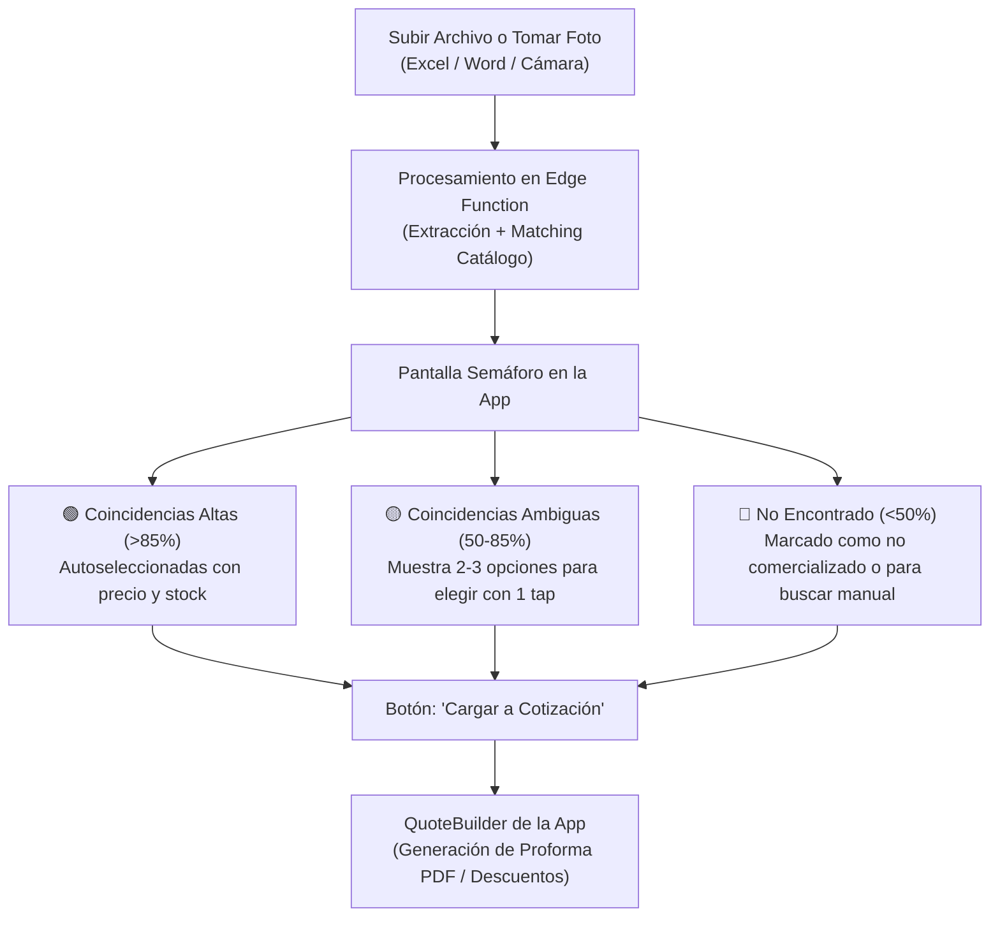

# Propuesta Técnica: Cotizador Masivo desde Documentos (Excel, Word, Fotos/OCR)

> **Estado**: Planificado / En Espera (Backlog)  
> **Fecha de formulación**: Septiembre 2026  
> **Módulo relacionado**: Cotizaciones (`src/features/quotes/`) y Catálogo (`src/features/catalog/`)

---

## 1. Problemática y Caso de Uso Real

### El Escenario de Campo
Cuando los asesores comerciales de Campo Maq visitan empresas clientes (constructoras, agrícolas, industrias), estas suelen entregar solicitudes de cotización masivas en formatos muy diversos:
- Archivos **Excel** (`.xlsx`, `.xls`, `.csv`) con listas de 20 a 100 ítems.
- Archivos **Word** (`.docx`) o **PDF** con descripciones libres.
- Hojas impresas o pedidos físicos donde el vendedor debe tomar una **fotografía**.

### Cuello de Botella Actual
Actualmente, el vendedor debe:
1. Abrir la app en su dispositivo móvil.
2. Buscar producto por producto en el catálogo.
3. Comparar las especificaciones y verificar el stock disponible.
4. Agregar manualmente cada ítem a la cotización con su tier de precio correspondiente.
5. Volcar los precios al formato o responder al cliente ítem por ítem.

**Impacto negativo**:
- Pérdida de 30 a 60 minutos por cotización masiva.
- Riesgo de error humano al seleccionar variantes similares (ej. potencia de motor, diámetro de manguera o marca).
- Lentitud en la respuesta comercial frente a la competencia.

---

## 2. Objetivos de la Solución

1. **Ingesta Multi-formato**: Permitir la carga de Excel, Word o fotos tomadas directamente con la cámara del celular.
2. **Extracción y Normalización**: Detectar automáticamente nombres de productos, cantidades solicitadas y unidades de medida.
3. **Matching Inteligente con Catálogo**: Asociar la descripción libre del cliente con el producto exacto o más cercano del catálogo de Campo Maq.
4. **Cálculo Financiero Inmediato**: Asignar precios según la lista/tier del cliente, verificar disponibilidad de stock y calcular el margen de utilidad.
5. **Revisión Asistida (Semáforo)**: Presentar una interfaz de verificación rápida para que el vendedor valide las coincidencias antes de emitir la proforma.
6. **Vuelco al Cotizador**: Cargar los ítems validados directamente al `QuoteBuilder` existente en la app.

---

## 3. Análisis Técnico: Motor de Coincidencia (Matching)

### ¿Por qué la "Búsqueda Fonética Pura" es Insuficiente?
Los algoritmos fonéticos tradicionales (*Soundex*, *Metaphone*) están diseñados para tolerar errores ortográficos en una palabra aislada (ej. *"Stihl"* vs. *"Estil"*), pero **fallan en descripciones técnicas** debido a:
- **Diferente orden de palabras**: El cliente escribe `"Bomba 2 pulg honda gasolina"` vs. Catálogo `"MOTOBOMBA HONDA WB20XH 2X2 GASOLINA 4T 4.8HP"`.
- **Abreviaturas técnicas**: `"galv."`, `"pulg."`, `"hp"`, `"psi"`, `"4t"`.
- **Nombres genéricos**: El cliente pide `"Manguera succión 2 pulgadas"` sin especificar marca o código interno.

### Solución Técnica Recomendada para el Matching
Se deben combinar dos capas:
1. **Fuzzy Token Matching (Token Set Ratio / N-gramas)**: Tolera palabras en desorden y errores tipográficos leves.
2. **Búsqueda Semántica con Embeddings o LLM Multimodal**: Entiende que `"motobomba de dos pulgadas a combustible"` es equivalente a `"WB20XH 2X2 GASOLINA"`.

---

## 4. Comparativa de Enfoques y Dificultad

| Enfoque | Dificultad | Viabilidad Móvil | Costo / Complejidad |
| :--- | :---: | :---: | :--- |
| **Enfoque A: 100% Nativo en el Móvil** (Librerías JS locales + Tesseract OCR) | **Alta (8.5/10)** | ⚠️ Deficiente | Muy pesado para el celular. El OCR local falla en tablas inclinadas o fotos borrosas. Procesar 50 productos drena batería y calienta el equipo. |
| **Enfoque B: Híbrido con Edge Function + IA Multimodal** *(Recomendado)* (Supabase Edge Function + Gemini 2.5 Flash) | **Media (5/10)** | ✅ Excelente | La app solo sube el archivo. La Edge Function usa IA multimodal que lee Excel, Word y fotos en 2 segundos. Costo insignificante (~$0.002 por documento). |

---

## 5. Flujo de Usuario y Pantalla Semáforo (UI/UX)

Para garantizar la precisión comercial y que el vendedor mantenga el control en todo momento, se implementará una pantalla de validación tipo **Semáforo**:

### Detalle de la Pantalla Semáforo:
- 🟢 **Verde**: Producto exacto encontrado. Muestra código, precio de lista, stock actual y margen.
- 🟡 **Amarillo**: Muestra opciones sugeridas (ej. *"¿Bomba WB20 económica o WB20XH estándar?"*). El vendedor toca la correcta.
- 🔴 **Rojo**: El producto no existe en el catálogo de Campo Maq. Se puede omitir o buscar un sustituto manualmente.

---

## 6. Hoja de Ruta de Implementación Sugerida

### Fase 1 — MVP: Importador de Excel / CSV (Rápido y de Alto Impacto)
- **Alcance**: Soporte para archivos `.xlsx` y `.csv`.
- **Lógica**: Selector de columnas simple (Columna de Descripción, Columna de Cantidad).
- **Matching**: Algoritmo difuso contra la caché local de productos o endpoint de Supabase.
- **Resultado**: Vuelco automático al `useQuoteBuilder` actual.

### Fase 2 — Asistente Inteligente Multimodal (Word, PDF y Fotos)
- **Alcance**: Reconocimiento de fotografías de cotizaciones en papel y archivos `.docx`.
- **Infraestructura**: Supabase Edge Function (`/api/parse-quote-document`) conectada a Gemini Flash.
- **Resultado**: Procesa tablas manuscritas, fotos con ángulo y textos no estructurados.

### Fase 3 — Exportación B2B Inversa
- **Alcance**: Opción de devolverle al cliente el **mismo archivo Excel que entregó**, con las columnas de precio, código Campo Maq y disponibilidad ya llenas.

---

## 7. Archivos de la App que se Integrarán

- [`src/features/quotes/QuoteBuilderProvider.tsx`](file:///C:/Users/raftd/GITHUB/campomaq-intern-android-app/src/features/quotes/QuoteBuilderProvider.tsx): Para inyectar los ítems masivos al estado de la cotización activa.
- [`src/features/catalog/services/productService.ts`](file:///C:/Users/raftd/GITHUB/campomaq-intern-android-app/src/features/catalog/services/productService.ts): Fuente de datos del catálogo para el matching.
- [`src/features/quotes/services/quoteCalculations.ts`](file:///C:/Users/raftd/GITHUB/campomaq-intern-android-app/src/features/quotes/services/quoteCalculations.ts): Para el cálculo automático de márgenes, subtotales e impuestos.
